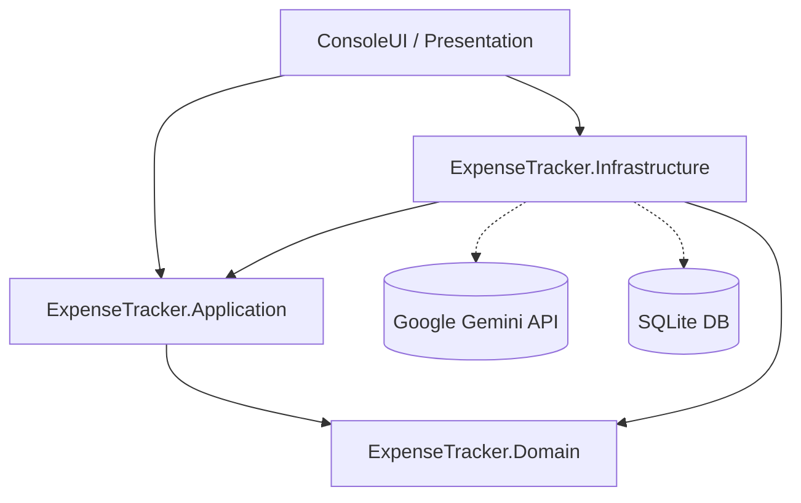

# 💳 Expense Tracker AI

<p align="center">
  <strong>Gestor y clasificador inteligente de gastos financieros con IA y Clean Architecture.</strong>
</p>

<p align="center">
  
  
  
  
  
</p>

---

## 📖 Acerca del Proyecto

**Expense Tracker AI** es una solución construida en **.NET 9** bajo los principios de **Clean Architecture** y **Domain-Driven Design (DDD)**. Su propósito es automatizar la ingesta de extractos bancarios o resúmenes de compras en texto plano, parsear sus movimientos y delegar la clasificación de cada consumo al modelo **Google Gemini**.

El sistema analiza las transacciones adaptándose a comercios locales (supermercados, estaciones de servicio, suscripciones, farmacias, etc.), infiere la categoría adecuada con un nivel de confianza (*confidence score*), gestiona dinámicamente las categorías en base de datos y almacena el resultado mediante **Entity Framework Core** y **SQLite**.

---

## ✨ Características Principales

- 📄 **Parseo Inteligente y Tolerante a Fallos:**
  - Ingesta de archivos de extractos bancarios delimitados por `;`.
  - Soporte flexible para múltiples formatos de fecha (`yyyy-MM-dd`, `dd/MM/yyyy`).
  - Normalización automática de importes numéricos con punto o coma decimal.
  - Ignora comentarios (`#`) y líneas vacías.
- 🧠 **Categorización Automática con Gemini AI:**
  - Integración nativa con la API de **Google Gemini** (`gemini-3.5-flash-lite`).
  - Salida estructurada garantizada en JSON (`response_mime_type: "application/json"`).
  - Contextualizado para reconocer comercios típicos (Coto, Carrefour, YPF, Shell, Netflix, Steam, Farmacity, etc.).
- 🎯 **Enfoque Human-in-the-Loop:**
  - Clasificación con niveles de certeza (`High`, `Medium`, `Low`).
  - Marcado automático de transacciones dudosas (`requiresReview: true`) para revisión humana.
- 🗄️ **Gestión Dinámica de Categorías:**
  - Reutiliza categorías ya registradas para mantener consistencia.
  - Genera y persiste nuevas categorías sugeridas por la IA si no existen previamente.
- 🏛️ **Arquitectura Limpia & Desacoplada:**
  - Capas estrictamente separadas con inversión de dependencias.
  - Implementación del patrón Repositorio y Options Pattern.
- 🔒 **Seguridad de Credenciales:**
  - Configuración sensible desacoplada usando **.NET User Secrets** para proteger la API Key de Gemini.

---

## 🛠️ Stack Tecnológico

| Capa / Componente | Tecnología / Librería |
| :--- | :--- |
| **Plataforma & Lenguaje** | [.NET 9.0](https://dotnet.microsoft.com/) / [C# 13](https://learn.microsoft.com/dotnet/csharp/) |
| **Inteligencia Artificial** | [Google Gemini API](https://ai.google.dev/) (`gemini-3.5-flash-lite`) |
| **Persistencia & ORM** | [Entity Framework Core 9](https://learn.microsoft.com/ef/core/) (Code-First Migrations) |
| **Base de Datos** | [SQLite](https://www.sqlite.org/) (`ExpenseTracker.db`) |
| **Inyección de Dependencias** | `Microsoft.Extensions.DependencyInjection` |
| **Cliente HTTP** | `Microsoft.Extensions.Http` (`IHttpClientFactory`) |
| **Configuración** | Options Pattern (`IOptions<T>`) y User Secrets |

---

## 🏛️ Arquitectura del Sistema

El proyecto sigue una estructura modular basada en **Clean Architecture**:

```text
ExpenseTracker/
├── ExpenseTracker.Domain/          # Núcleo de negocio (Entidades, Reglas de dominio)
│   └── Entities/                   # Expense, Category
├── ExpenseTracker.Application/     # Casos de uso y contratos
│   ├── Common/                     # Interfaces (IAiCategorizerService, IStatementParser, Repositorios) y DTOs
│   └── UseCases/                   # ImportStatementUseCase
├── ExpenseTracker.Infrastructure/  # Implementaciones técnicas y servicios externos
│   ├── Configuration/              # GeminiOptions (Options Pattern)
│   ├── Data/                       # ApplicationDbContext, Repositories, Migrations
│   ├── Parsers/                    # SimpleTextStatementParser
│   └── Services/                   # GeminiCategorizerService (Integración HTTP con Gemini)
└── ExpenseTracker.ConsoleUI/       # Punto de entrada / Presentación
    └── Program.cs                  # Setup de DI, migraciones y ejecución de prueba
```



---

## 📋 Formato de Entrada de Extractos

El parser admite archivos de texto (`.txt`) con transacciones separadas por punto y coma (`;`).

Ejemplo de `statement.txt`:

```text
# Extracto bancario de prueba
2026-09-25; Coto Sucursal 14; 15420.50
2026-09-25; Steam Games Purchase; 3499.00
2026-09-24; YPF Estacion 42; 25000,00
# Líneas de comentario son ignoradas automáticamente
24/09/2026; Farmacity 210; 8950.25
2026-09-22; Netflix Mensual; 7500.00
```

---

## 🚀 Puesta en Marcha (Guía Paso a Paso)

### 1. Prerrequisitos
- [.NET 9.0 SDK](https://dotnet.microsoft.com/download/dotnet/9.0) instalado.
- Una API Key de [Google AI Studio](https://aistudio.google.com/).

### 2. Clonar el repositorio
```bash
git clone https://github.com/SamGrH/Expense-Tracker.git
cd Expense-Tracker
```

### 3. Configurar la API Key de Gemini
Para evitar exponer tu clave en el control de versiones, utiliza **User Secrets**:

```bash
cd ExpenseTracker/ExpenseTracker.ConsoleUI
dotnet user-secrets set "Gemini:ApiKey" "TU_API_KEY_DE_GEMINI"
```

*(Opcional)* Si deseas cambiar el modelo por defecto (`gemini-3.5-flash-lite`), puedes configurarlo con:
```bash
dotnet user-secrets set "Gemini:Model" "gemini-1.5-flash"
```

### 4. Compilar y Ejecutar
Regresa a la raíz de la solución y ejecuta la aplicación de consola:

```bash
cd ../..
dotnet run --project ExpenseTracker/ExpenseTracker.ConsoleUI
```

> **Nota:** La aplicación aplica automáticamente las migraciones pendientes de SQLite al iniciar (`await dbContext.Database.MigrateAsync()`) y genera un archivo `statement.txt` de ejemplo si no existe uno en el directorio de ejecución.

---

## 🖥️ Ejemplo de Salida en Consola

```text
=== EXPENSE TRACKER - IMPORT STATEMENT ===

📄 Archivo de prueba creado: 'statement.txt'

🚀 Iniciando importación y categorización con IA...

✅ Se importaron 5 transacciones exitosamente.

=== GASTOS REGISTRADOS EN LA BASE DE DATOS ===
[2026-09-25] Coto Sucursal 14          | $ 15.420,50 | Categoría: Alimentos
[2026-09-25] Steam Games Purchase      | $  3.499,00 | Categoría: Entretenimiento
[2026-09-24] YPF Estacion 42           | $ 25.000,00 | Categoría: Combustible
[2026-09-24] Farmacity 210             | $  8.950,25 | Categoría: Farmacia
[2026-09-22] Netflix Mensual           | $  7.500,00 | Categoría: Entretenimiento

=== FIN DEL CIRCUITO ===
```

---

## 🗺️ Próximos Pasos & Roadmap

- [ ] Soporte para extractos en formato **PDF** y planillas **CSV/Excel**.
- [ ] Interfaz Web / Dashboard interactivo (ASP.NET Core Web API + Blazor / React).
- [ ] Gráficos y reportes mensuales de distribución de presupuesto.
- [ ] Flujo interactivo para confirmación de transacciones marcadas con `requiresReview: true`.
- [ ] Pruebas unitarias y de integración (xUnit, Moq, FluentAssertions).

---

## 👤 Autor

Desarrollado con ❤️ por **[SamGrH](https://github.com/SamGrH)**.
